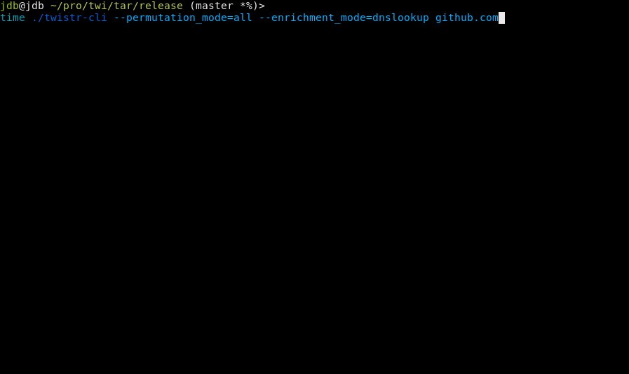

# Twistr  

  > This project is still a work-in-progress and the core library interface is bound to change soon. The following are a list of action items and features to implement before releasing an initial beta version.
  
---


> Twistr is a Domain name permutation and enumeration library powered by Rust & Rayon. It aims to directly port the well-known [dnstwist](https://github.com/elceef/dnstwist) tool allowing for fast and flexible interfacing capabilities with the core libraries based on client's requirements.

<br/><br/><br/><br/>

---

## Demo

The following is a rough demo of an [example implementation](examples/twistr-cli) of the library trying to enumerate `github.com`. Compared with the [dnstwist example](/res/dnstwist-github_com.gif), `twistrs` is able to enumerate and resolve more domains at a fraction of the time.
  


## Usage

The core library is composed of the domain permutation module and the domain enrichment module that can be used individually or chained together.

```rust
use std::collections::HashMap;
use std::sync::{Arc, Mutex};

use twistrs::enrich::{enrich, DomainStore, EnrichmentMode};
use twistrs::permutate::{Domain, PermutationMode};

let domain = Domain::new("www.example.com").unwrap();

match domain.permutate(PermutationMode::All) {
    Ok(permutations) => {  
      let mut domain_store: DomainStore = Arc::new(Mutex::new(HashMap::new()));
      enrich(EnrichmentMode::DnsLookup, permutations, &mut domain_store).unwrap();
      
      println!("Output: {:?}", &domain_store.lock().unwrap());
    }
    Err(e) => panic!(e),
}
```

## Features

- Granular control over Permutation or Enrichment modules
  + Use specific permutation algorithms (e.g. homoglyphs)
  + Use specific data enrichment methods (e.g. DNS lookup)
- Concurrency out of the box
- Exceptionally fast end-to-end results
- Core library allowing easy extensions (i.e. CLI, API & streams)

#### Permutation Modes

- Addition ✅
- Bit Squatting ✅
- Homoglyph ✅
- Hyphenation ✅
- Insertion ✅
- Omission ✅
- Repetition ✅
- Replacement ✅
- Sub-domain ✅
- Transposition ✅
- Vowel-swap ✅

#### Domain Enrichment Features

- DNS lookup ✅
- MX parsing ✅
- SMTP Banner ❌
- HTTP Banner ❌
- GeoIP Lookup (Cached) ❌
- WhoIs Lookup ❌

#### Miscellaneous

- Benchmarking ❌
- Concurrent ✅
- Blog post ❌
- Crates.io ❌

---

## License

This project is licensed under the [MIT license](LICENSE).

### Contribution

Unless you explicitly state otherwise, any contribution intentionally submitted
for inclusion in Tokio by you, shall be licensed as MIT, without any additional
terms or conditions.
