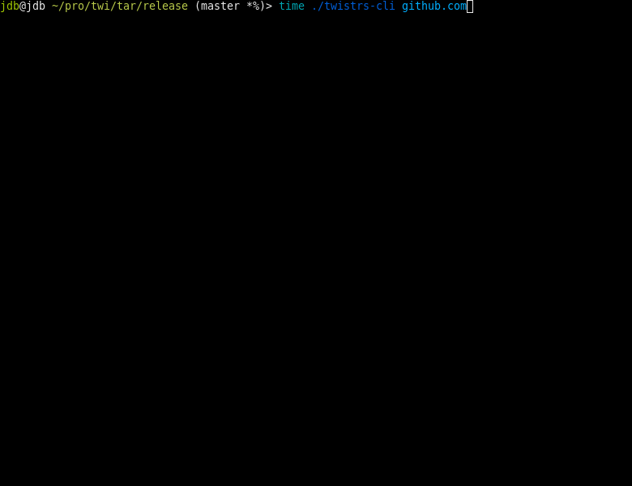

# Twistrs CLI Example

A trivial CLI powered by Twistrs and Clap to generate domain permutations and perform DNS resolution.

## Demo

The following is a rough demo of an [example implementation](src/main.rs) of the library trying to enumerate `github.com`. Compared with the [dnstwist example](../..//res/dnstwist-github_com.gif), `twistrs` is able to enumerate and resolve more domains at a fraction of the time.
  

