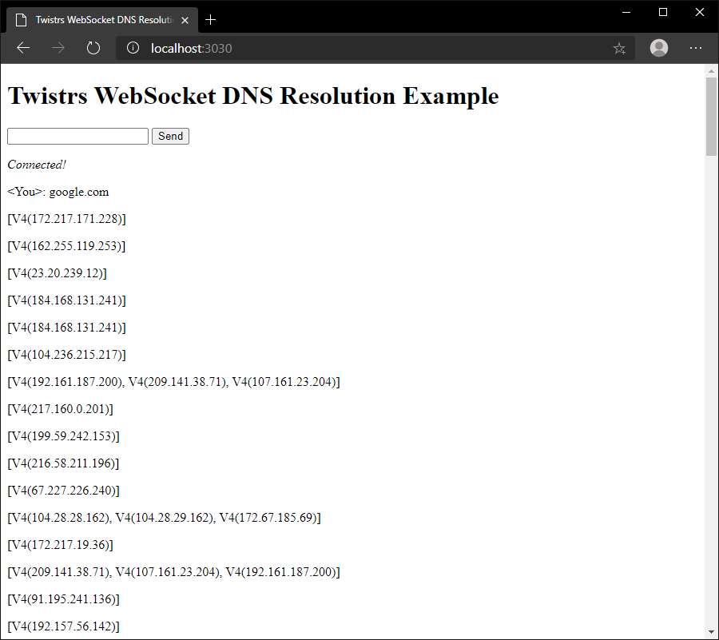

# Twistrs WebSocket Example

A static and simple WebSocket client implementation of Twistrs powered by [Warp](https://github.com/seanmonstar/warp).

This implementation is a small refactor of Warp's [WebSocket Chat example](https://github.com/seanmonstar/warp/blob/master/examples/websockets_chat.rs), for details on the implementation it is recommended to review the original example.

## Demo

To run the websocket server, compile the websocket example:

```
cd /path/to/twistrs
cd examples/twistrs-ws
cargo r
```

You can then access the static client on http://localhost:3030 which will allow you to request an FQDN to perform DNS resolution against asynchronously.

> **Note** — no user validation is being performed.
  

